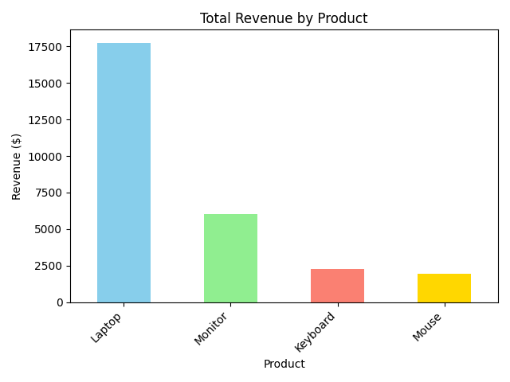

# Data-Analyst-internship-Task-7
# Basic Sales Summary using Python and SQLite

[cite_start]This project is a submission for the **Elevate Labs Data Analyst Internship**[cite: 2]. [cite_start]The main objective is to demonstrate the ability to use SQL within a Python script to perform a simple sales analysis, retrieve summary data, and create a basic visualization[cite: 6].

---

##  Tools Used

* [cite_start]**Python** [cite: 8]
* [cite_start]**SQLite** (via the built-in `sqlite3` library) [cite: 8, 9]
* [cite_start]**Pandas** for loading and managing the queried data [cite: 8, 22]
* [cite_start]**Matplotlib** for creating the bar chart visualization [cite: 8, 24]

---

##  What the Script Does

The Python script (`sales_analysis.py`) performs the following actions:

1.  [cite_start]**Creates a Database:** It generates a fresh SQLite database file named `sales_data.db`[cite: 12].
2.  **Populates Data:** It creates a `sales` table and inserts sample sales records into it.
3.  [cite_start]**Analyzes Sales:** It runs an SQL query that groups sales data by product to calculate the total quantity sold and the total revenue for each product[cite: 15, 20, 21].
4.  [cite_start]**Displays Results:** The script prints the summarized sales data as a clean table in the console[cite: 16, 23].
5.  [cite_start]**Visualizes Data:** Finally, it generates a bar chart to visually represent the total revenue per product and saves it as an image file named `sales_revenue_chart.png`[cite: 16, 25].

---

##  How to Run

1.  **Prerequisites:** Ensure you have Python 3 installed.
2.  **Clone the Repository:**
    ```sh
    git clone <your-repository-url>
    cd <your-repository-name>
    ```
3.  **Install Dependencies:** Install the required Python libraries using pip.
    ```sh
    pip install pandas matplotlib
    ```
4.  **Execute the Script:** Run the Python script from your terminal.
    ```sh
    python sales_analysis.py
    ```

---

##  Expected Output

After running the script, you will see the following summary printed to your console:

```
--- Sales Summary ---
   product  total_quantity   revenue
0   Laptop              15  17755.00
1  Monitor              20   6000.00
2 Keyboard              30   2272.50
3    Mouse              75   1937.50
```

Additionally, a bar chart image file named **`sales_revenue_chart.png`** will be created in the project directory:



---

**Author:** Ayush Rawat 
**Date:** 25-09-2025
